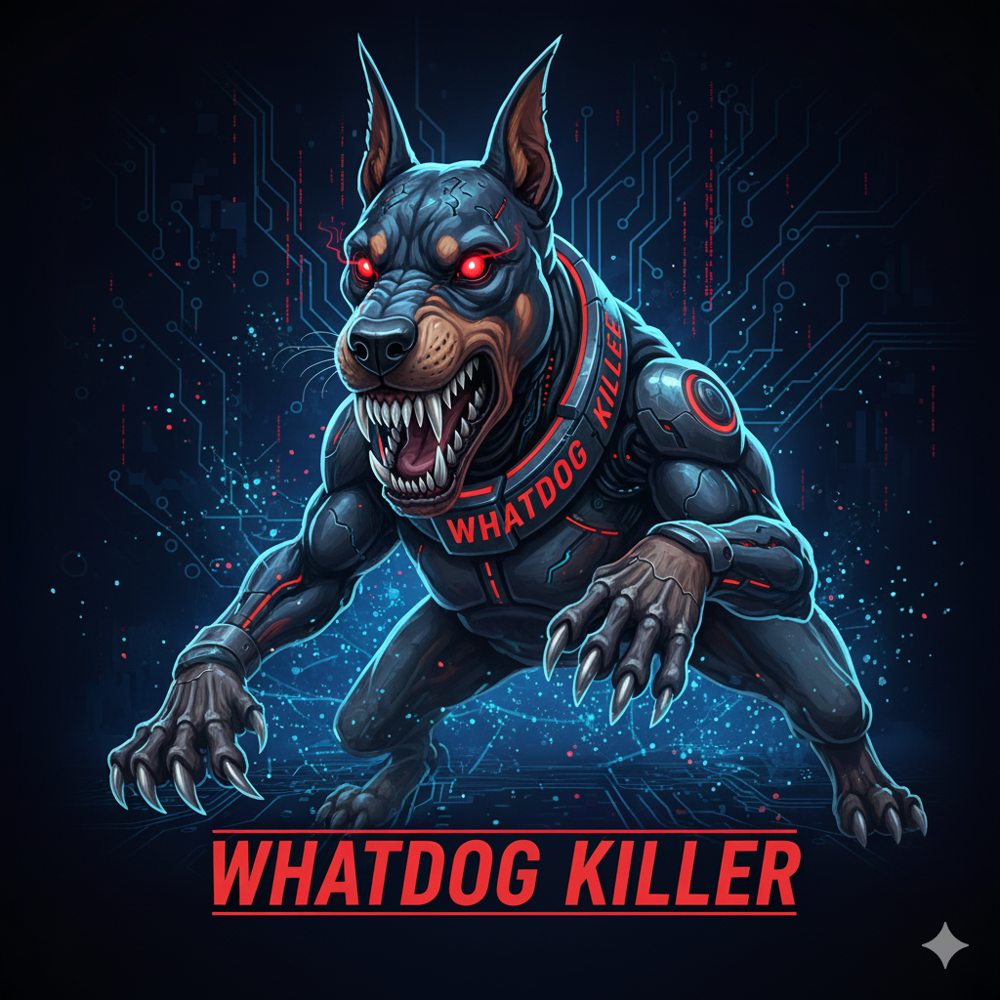

# Watchdog Killer

**Herramienta Avanzada de Terminación de Procesos en Windows**



[](https://www.rust-lang.org/)
[](https://www.microsoft.com/windows)
[](https://opensource.org/licenses/MIT)
[](https://github.com/yourusername/WatchdogKiller)

## Aviso Legal

**AVISO LEGAL IMPORTANTE:**

Este software se proporciona únicamente con **fines educativos y de investigación**. Los usuarios son los únicos responsables de garantizar el cumplimiento de todas las leyes y regulaciones aplicables.

**Al usar este software, reconoces que:**
- Solo úsalo en sistemas que poseas o tengas autorización explícita por escrito
- Esta herramienta explota una vulnerabilidad de driver - comprende los riesgos
- Los autores no son responsables de ningún daño, consecuencias legales o mal uso
- Úsalo solo en entornos controlados para investigación de seguridad legítima

**Si no estás de acuerdo con estos términos, no uses este software.**

## Descripción General

**Watchdog Killer** es una herramienta de terminación de procesos de Windows escrita en Rust que explota una vulnerabilidad en el driver de Watchdog Anti-Virus. Esta herramienta demuestra cómo los drivers de software de seguridad legítimo pueden ser abusados para terminar procesos protegidos, incluyendo soluciones antivirus y EDR.

Este proyecto sirve como prueba de concepto para la técnica de ataque "Bring Your Own Vulnerable Driver" (BYOVD), comúnmente utilizada por grupos APT y operadores de ransomware para deshabilitar software de seguridad.

## Características

- **Terminación Manual por PID** - Termina procesos específicos por ID de proceso
- **Detección Inteligente de EDR/AV** - Detecta y termina automáticamente software de seguridad conocido
- **Listado de Procesos** - Visualiza procesos en ejecución con información detallada
- **Terminación por Nombre** - Busca y termina procesos por coincidencia parcial de nombre
- **Operaciones en Lote** - Termina múltiples procesos simultáneamente
- **Integración con Driver** - Evita la protección de procesos usando el driver vulnerable de Watchdog
- **Interfaz CLI Moderna** - Interfaz de línea de comandos colorida e intuitiva

## Instalación

### Requisitos Previos
- Windows 10/11 x64
- Privilegios de administrador
- Rust toolchain (para compilar)

### Inicio Rápido
```bash
git clone https://github.com/3xploit666/WatchDog_Killer.git
cd WatchdogKiller
cargo build --release
.\target\release\watchdog_killer.exe
```

## Uso

### Opciones del Menú Principal

```
═══════════════════════════════════════
    WATCHDOG KILLER - MENÚ PRINCIPAL
═══════════════════════════════════════
  [1] Terminación Manual por PID
  [2] Terminación Inteligente de EDRs
  [3] Listar Procesos en Ejecución
  [4] Terminar Proceso por Nombre
  [5] Terminación en Lote de PIDs
  [0] Salir
═══════════════════════════════════════
```

## Detalles Técnicos

Esta herramienta explota una vulnerabilidad en el driver de Watchdog Anti-Virus que permite a procesos sin privilegios terminar procesos protegidos a través de manipulación de IOCTL.

**Detalles Técnicos Clave:**
- **Lenguaje**: Rust
- **Objetivo**: Windows x64
- **Método**: Abuso de IOCTL del driver Watchdog
- **IOCTL Primario**: `0x80002048` (Terminación de Procesos)
- **Driver Vulnerable**: `wamsdk.sys`
- **SHA256**: `5AF1DAE21425DDA8311A2044209C308525135E1733EEFF5DD20649946C6E054C`
- Evita mecanismos de protección de procesos de Windows
- No requiere escalación de privilegios
- Funciona en sistemas Windows 10/11 x64

## Consideraciones de Seguridad

### Casos de Uso Legítimos
- Investigación y pruebas de seguridad
- Administración de sistemas en equipos propios
- Análisis de malware en entornos controlados
- Propósitos educativos

### Pautas Éticas
- Solo usar en sistemas que poseas o tengas autorización explícita
- No usar con propósitos maliciosos
- Siempre obtener autorización adecuada
- Usar en entornos aislados/controlados

## Licencia

Licencia MIT - ver archivo [LICENSE](LICENSE) para detalles.

## Reconocimientos

**Investigación Original:** [j3h4ck](https://github.com/j3h4ck/WatchDogKiller) - Proyecto WatchDogKiller e investigación de vulnerabilidades

## Documentación Detallada

**Análisis Técnico Completo**: [Watchdog Killer BYOVD - Análisis Detallado](https://3xploit666.com/post/whatdog-killer-byovd-0cb155a0)

Este blog post incluye:
- Análisis profundo del driver vulnerable wamsdk.sys
- Detalles técnicos de la explotación BYOVD
- Implementación completa en Rust
- Consideraciones de seguridad

## Contacto

- **Autor**: @3xploit666
- **Blog**: https://3xploit666.com/post/whatdog-killer-byovd-0cb155a0
- **LinkedIn**: https://www.linkedin.com/in/javier-perez-0582ba1b1/
- **Medium**: https://medium.com/cyberscribers-exploring-cybersecurity/gain-wpe-credentials-with-evil-twin-attacks-4b6d6c9f507a

---

**Recuerda**: Esta herramienta es solo para fines educativos y de investigación. Úsala de manera responsable y ética.
